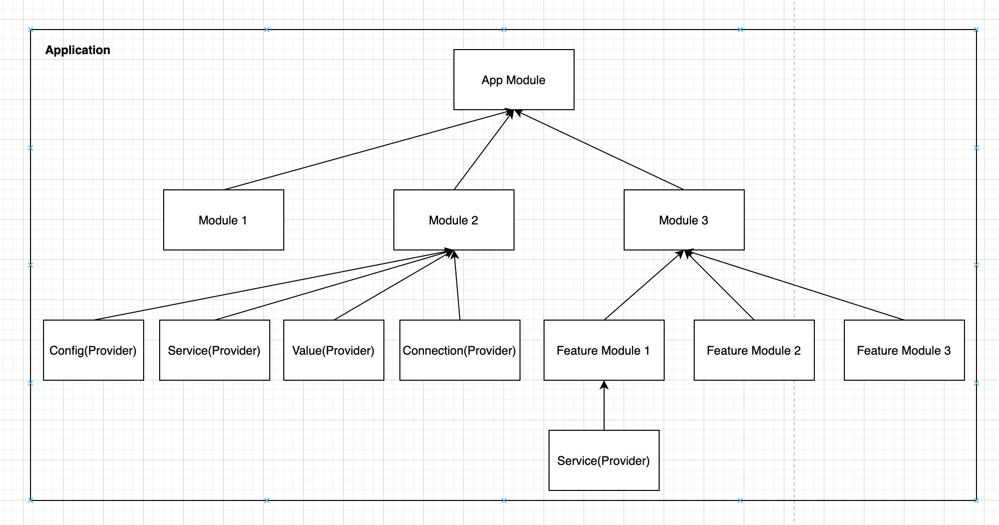

# augejs

[](https://www.npmjs.com/package/@augejs/core) [](https://github.com/RichardLitt/standard-readme)

[`augejs`](https://augejs.github.io/docs/) is a progressive Node.js framework for building applications.

:star2: Star us on GitHub — it helps! :clap:

## Table of Contents

- [Description](#description)
- [Features](#features)
- [Install](#install)
- [Usage](#usage)
- [Package Dependencies](#package-dependencies)
- [Lifecycle](#lifecycle)
- [Related Efforts](#related-efforts)
- [Maintainers](#maintainers)
- [Contributing](#contributing)
- [License](#license)

## Description

`augejs` is a progressive Node.js framework for building applications. It uses modern JavaScript built with [TypeScript](http://www.typescriptlang.org/).

Look at a diagram below:



An application is composite of  3 types of element:

`Provider` is an abstract logic unit which can provide for `Module`.

`Decorator` is an abstract logic unit  which can decorate for `Module` and `Provider`.

`Module` is consists of  `Provider` and `Module`.

>  This is the one of fundamental concept for `augejs`. 

## Features

+ :penguin:	The core layer is small, simple and extensible.

+ :baby_chick: Progressive Development.

## Install

This project uses [node](http://nodejs.org) and [npm](https://npmjs.com). Go check them out if you don't have them locally installed.

```sh
npm install @augejs/core
```

## Usage

```javascript
import { Module, boot } from '@augejs/core';

// we use a @Module decorator to define a module
@Module()
class AppModule {
  async onInit() {
    // the onInit lifecycle method will be called when application boot
    console.log('hello augejs');
  }
}

(async () => {
  // boot the whole application by module.
  await boot(AppModule);
})();
```

## Package Dependencies


## Lifecycle

There is the lifecycle name for `Module` And `Provider`.


Please take a look at this link [provider-scanner-hook](https://github.com/augejs/provider-scanner#hookmetadata), `augejs` is on top of that. `augejs` application boot flow is a middleware execute mode.

## Cluster Decorator

See [examples/cluster](https://github.com/augejs/examples/blob/master/packages/cluster/src/main.ts)

```javascript
@Cluster({
  workers: 2
}) 
@Module()
class AppModule() {
}
```

The above code, the program will startup as a master daemon process and the `AppModule` will startup as a worker process. If the worker process is exit with an exception or killing by other cases
then the master process will fork a new work process for `AppModule`.

If the master process is exit with signal(SIGTERM), the work process will shutdown gracefully. 

### Document

visit [augejs.github.io](https://augejs.github.io/docs/). :tada:

## Examples

see the [Examples](https://github.com/augejs/examples). :open_book:

## Related Efforts

- [Art of Readme](https://github.com/noffle/art-of-readme) - 💌 Learn the art of writing quality READMEs.
- [open-source-template](https://github.com/davidbgk/open-source-template/) - A README template to encourage open-source contributions.

## Maintainers

[Alex Zhang](https://github.com/alex-zhang).

## Contributing

Feel free to dive in! [Open an issue](https://github.com/augejs/core/issues) or submit PRs.

`augejs` follows the [Contributor Covenant](http://contributor-covenant.org/version/1/3/0/) Code of Conduct.

### Contributors

This project exists thanks to all the people who contribute. 

...

## License

[MIT](LICENSE) © augejs
